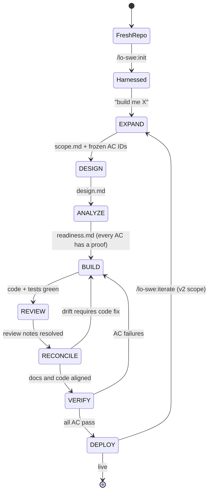

# lights-out-swe-plugin (`lo-swe`)

**Autonomous, gated software-engineering pipeline for AI coding agents.**

[](./CHANGELOG.md)
[](./LICENSE)
[](#install)

`lo-swe` is an agent plugin for GitHub Copilot CLI, Claude Code, and VS Code Copilot. It bundles a gated software-engineering pipeline — agents, skills, prompts, and a project bootstrap — as a one-command install.

## What it is

`lo-swe` packages a gated software-engineering pipeline that an AI coding agent runs end-to-end inside a real repo. You set the constraints in `preferences.md` and `docs/input/`. The agent runs `EXPAND > DESIGN > ANALYZE > BUILD > REVIEW > RECONCILE > VERIFY > DEPLOY`, writing each phase's reasoning to `scaffolding/` and committing as it goes.

The model is a dark-factory analogy: unmanned third shift, lights off, but instrumented well enough that the morning operator can audit everything that happened. The instrumentation only pays off if you supply the right inputs.

### What you have to provide before the agent starts

1. A real spec in `docs/input/`. PRDs, API contracts, customer briefs, design docs. For anything with non-trivial control flow, a [TLA+ state machine](https://tlaplus-process-studio.com) drafted with customers in [tlaplus-process-studio](https://github.com/RCSnyder/tlaplus-process-studio) pins down behavior before any code is written.
2. A populated `preferences.md` for this project: language, framework, deploy target, testing style, formatting, and any patterns the team insists on. The pipeline treats it as binding. Run `/lo-swe:audit-stack` to sanity-check it against the problem before EXPAND.
3. A willingness to read `scaffolding/*.md` and `git log` instead of every line of code. Each phase commits its own artifacts, so a maintainer can pause, edit, or revert at any commit boundary.

Skip any of those three and you are back to vibe coding with extra steps.

The plugin ships only the reusable pieces: agents and skills. The project-root harness (`copilot-instructions.md`, `preferences.md`, `scaffolding/`, `docs/input/`) is written into a fresh repo by [`/lo-swe:init`](skills/init/SKILL.md).

### Pipeline

```text
EXPAND > DESIGN > ANALYZE > BUILD > REVIEW > RECONCILE > VERIFY > DEPLOY
```

Each transition is guarded by a machine-checkable condition on the artifacts written so far. A failed gate sends the agent backward, not forward.



The hard gates: ANALYZE checks every `AC-*` has a concrete proof path before BUILD starts. RECONCILE checks scaffolding and code agree. VERIFY checks tests are green and each `AC-*` is satisfied by a named test.

## What the gates actually catch (and what they don't)

Unsupervised coding agents have characteristic failure modes. The gates address some of them directly. Others are only made cheap to find after the fact via the commit trail.

| Failure mode                                             | Caught by                                                                            |
| -------------------------------------------------------- | ------------------------------------------------------------------------------------ |
| Scope creep beyond the agreed AC set                     | EXPAND freezes AC IDs; RECONCILE flags out-of-scope code                             |
| Reinterpreting an AC during implementation               | ANALYZE requires a concrete proof path per AC; RECONCILE re-reads code vs. AC        |
| Mocking an integration and shipping the stub             | RECONCILE compares design intent against actual code; VERIFY requires the named test |
| Weakening a failing test to make it pass                 | Visible in `git log` and `log.md`; VERIFY reruns the suite                           |
| Stack drift (switching language or framework mid-flight) | `/lo-swe:audit-stack` before EXPAND; BUILD reads `preferences.md`                    |
| Snowball refactors of unrelated files                    | Per-phase commits; reviewer can diff each phase in isolation                         |

The gates do not catch: a test that tests the wrong thing, an invented library call that happens to compile via stub, a subtle correctness bug outside the AC set. Those still need a reviewer. The provenance trail makes them cheap to find, not impossible to commit.

## Where humans stay in the loop

| Activity                        | Who                   | When                              |
| ------------------------------- | --------------------- | --------------------------------- |
| Write `preferences.md`          | Maintainer or lead    | Once per project, before init     |
| Supply PRDs, specs, TLA+ models | Product and customers | Before EXPAND, and before iterate |
| Approve `scope.md` after EXPAND | Reviewer (optional)   | Before DESIGN                     |
| Inspect mid-pipeline            | Anyone                | Any commit boundary               |
| Stop the pipeline               | Anyone                | When a gate's verdict looks wrong |
| Approve VERIFY before DEPLOY    | Reviewer              | Before production                 |

Nothing prevents a developer from taking the wheel mid-phase. Commit your edits and run the next phase command to hand control back.

## Agents

Invoke as `@lo-swe:<name>` in chat.

| Agent                                  | Purpose                                                                                                              |
| -------------------------------------- | -------------------------------------------------------------------------------------------------------------------- |
| [analyze](agents/analyze.agent.md)     | Pre-BUILD admission control. Maps `AC-*` to proofs, separates truths from assumptions, blocks silent simplification. |
| [explore](agents/explore.agent.md)     | Read-only codebase Q&A. Recovers context, locates implementations, answers without edit risk.                        |
| [reconcile](agents/reconcile.agent.md) | Cross-checks scaffolding documents against the actual codebase. Detects and fixes drift.                             |
| [review](agents/review.agent.md)       | Reviews built code for correctness, readability, architecture, security, and performance.                            |
| [verify](agents/verify.agent.md)       | Runs tests, validates AC coverage, checks security and deployment readiness.                                         |

## Slash commands (skills)

Invoke as `/lo-swe:<name>` in chat. Source files live in `skills/<name>/SKILL.md`. The plugin name (`lo-swe`) is automatically prepended as a namespace prefix by the plugin loader — you do not write it into the skill's `name:` field.

| Command               | Purpose                                                                                |
| --------------------- | -------------------------------------------------------------------------------------- |
| `/lo-swe:init`        | **Entry point.** Scaffolds the harness into a fresh repo. Run this first.              |
| `/lo-swe:expand`      | Expand a one-liner into `scaffolding/scope.md` with stable AC IDs and stack choices.   |
| `/lo-swe:design`      | Produce `scaffolding/design.md` with architecture, structure, and interfaces.          |
| `/lo-swe:analyze`     | Produce `scaffolding/readiness.md`; gate on AC traceability and scope risk.            |
| `/lo-swe:distill`     | Structure raw materials in `docs/input/` into reference docs the pipeline can consume. |
| `/lo-swe:build`       | Implement vertical slices, test-first, following the `build-discipline` skill.         |
| `/lo-swe:review`      | Audit built code before reconciliation and verification.                               |
| `/lo-swe:reconcile`   | Reconcile scaffolding against code; fix drift.                                         |
| `/lo-swe:verify`      | Run all tests, verify AC, security, deployment readiness.                              |
| `/lo-swe:deploy`      | Push to target, verify live, write project README.                                     |
| `/lo-swe:iterate`     | Re-enter the pipeline for a shipped project with new feedback or requirements.         |
| `/lo-swe:audit-stack` | Sanity-check `preferences.md` stack choices against the problem domain.                |

### Phase artifacts (what each command reads and writes)

| Phase     | Reads                                                             | Writes                                              |
| --------- | ----------------------------------------------------------------- | --------------------------------------------------- |
| EXPAND    | user one-liner, `preferences.md`, `docs/input/`                   | `scaffolding/scope.md` (frozen `AC-*` IDs)          |
| DESIGN    | `scope.md`                                                        | `scaffolding/design.md`                             |
| ANALYZE   | `scope.md`, `design.md`                                           | `scaffolding/readiness.md`                          |
| BUILD     | `scope.md`, `design.md`, `readiness.md`, `build-discipline` skill | source code, tests, `scaffolding/log.md`            |
| REVIEW    | code, scaffolding                                                 | `scaffolding/review.md`                             |
| RECONCILE | scaffolding, code                                                 | scaffolding fixes, code fixes, `scaffolding/log.md` |
| VERIFY    | code, tests, `readiness.md`                                       | `scaffolding/verify.md` (pass/fail per AC)          |
| DEPLOY    | verified build                                                    | live deployment, project `README.md`                |
| ITERATE   | shipped project, new feedback                                     | re-entry, next `scope.md` revision                  |

## Layout

```text
lights-out-swe-plugin/
  .claude-plugin/
    plugin.json
    marketplace.json
  agents/
    analyze.agent.md
    explore.agent.md
    reconcile.agent.md
    review.agent.md
    verify.agent.md
  skills/
    build-discipline/SKILL.md
    init/SKILL.md
    expand/SKILL.md
    design/SKILL.md
    analyze/SKILL.md
    distill/SKILL.md
    build/SKILL.md
    review/SKILL.md
    reconcile/SKILL.md
    verify/SKILL.md
    deploy/SKILL.md
    iterate/SKILL.md
    audit-stack/SKILL.md
  .github/workflows/release-please.yml
  release-please-config.json
  .release-please-manifest.json
  CHANGELOG.md
  LICENSE
  README.md
  .gitignore
```

## Install

### GitHub Copilot CLI

```bash
copilot plugin marketplace add RCSnyder/lights-out-swe-plugin
copilot plugin install lo-swe@lo-swe
```

### Claude Code

```bash
claude plugin marketplace add RCSnyder/lights-out-swe-plugin
claude plugin install lo-swe@lo-swe
```

### VS Code (Copilot, Preview)

Requires `chat.plugins.enabled: true`. Add the marketplace to your `settings.json`:

```json
"chat.plugins.marketplaces": [
  "RCSnyder/lights-out-swe-plugin"
]
```

Then run **Chat: Install Plugin** from the Command Palette and pick `lo-swe`.

VS Code also auto-discovers anything installed via the Copilot CLI from `~/.copilot/installed-plugins/`.

### Verify the install

```bash
copilot plugin marketplace list   # lights-out-swe-plugin should appear
copilot plugin list               # lo-swe should appear, version 1.0.0
```

Then in an interactive session:

```
/agent
```

The five `Lights Out SWE: ...` agents should be listed. Run `/lo-swe:init` to bootstrap a project.

## Usage

### Quickstart (zero to first build)

```bash
# 1. Install the plugin (Copilot CLI shown; use the Claude or VS Code variant from above as needed)
copilot plugin marketplace add RCSnyder/lights-out-swe-plugin
copilot plugin install lo-swe@lo-swe

# 2. Make a fresh repo
mkdir my-project && cd my-project && git init -b main

# 3. Open chat, then run
#    /lo-swe:init
#    git add -A && git commit -m "chore: bootstrap lo-swe harness"

# 4. Tell the agent what to build, in chat:
#    build me a CLI that counts words in a file
```

### What the dev sees, step by step

```mermaid
sequenceDiagram
    actor Dev
    participant Chat as Chat (Copilot / Claude / VS Code)
    participant Repo as Fresh repo
    participant Pipeline as lo-swe pipeline

    Dev->>Repo: git init
    Dev->>Chat: /lo-swe:init
    Chat->>Repo: write .github/copilot-instructions.md,<br/>preferences.md, scaffolding/, docs/input/, .gitignore
    Dev->>Repo: git commit
    Dev->>Chat: "build me a CLI that counts words in a file"
    Chat->>Pipeline: EXPAND
    Pipeline->>Repo: scaffolding/scope.md (AC-001 ... AC-N)
    Pipeline->>Repo: scaffolding/design.md
    Pipeline->>Repo: scaffolding/readiness.md
    Pipeline->>Repo: src/, tests/ (BUILD, test-first)
    Pipeline->>Repo: scaffolding/review.md, log.md
    Pipeline->>Repo: scaffolding/verify.md (all AC pass)
    Pipeline->>Dev: ready to deploy
    Dev->>Chat: /lo-swe:deploy
    Chat->>Repo: push to target, write project README
```



### Worked example: "build me a CLI that counts words in a file"

After `/lo-swe:init` and the build prompt, ANALYZE refuses to enter BUILD until every `AC-*` has a concrete proof path in `readiness.md` (e.g. `AC-002 -> tests/cli.rs::missing_file_exits_nonzero`). BUILD writes the code and the named tests, one vertical slice at a time. VERIFY runs the suite and writes pass/fail per AC. DEPLOY pushes and writes the project's user-facing README. Every artifact stays committed in `scaffolding/`, which is the provenance trail.

EXPAND first writes something like `scaffolding/scope.md`:

```markdown
# Scope: word-count CLI

## Problem

Users need a fast, scriptable way to count words in one or more files.

## Smallest useful version

A single binary `wc-lite` that takes one or more file paths and prints `<count> <path>` per file.

## Acceptance criteria

- AC-001: `wc-lite README.md` prints the word count and path on stdout, exit 0.
- AC-002: `wc-lite missing.txt` exits non-zero with a message on stderr.
- AC-003: `wc-lite a.txt b.txt` prints one line per file, in argv order.
- AC-004: Words are runs of non-whitespace separated by whitespace (Unicode aware).

## Stack

Rust (per preferences.md). Single static binary. Deploy via cargo publish + GitHub release.
```

### Three rules of thumb

1. Do not edit `scaffolding/` by hand mid-pipeline. Let the agents own it. Hand edits cause drift that RECONCILE will flag and bounce.
2. Treat `docs/input/` as evidence, not instructions. Drop briefs and API specs there; the pipeline reads them as product context, not as orders.
3. `AC-*` IDs are stable for the life of the project. Once EXPAND assigns them, they trace through DESIGN, ANALYZE, VERIFY, and back into ITERATE. Renaming them breaks the audit trail.

## Naming conventions

- Plugin name: `lo-swe`. This is the namespace prefix in invocations: `/lo-swe:<command>` and `@lo-swe:<agent>`.
- Repo name: `lights-out-swe-plugin`.
- File names inside `agents/` and `skills/` are bare action names (`reconcile.agent.md`, `skills/reconcile/SKILL.md`, not `lo-swe-reconcile.*`). The plugin name is prepended by the loader; repeating it produces ugly invocations like `/lo-swe:lo-swe-reconcile`.
- Agent files use the `.agent.md` extension. Skills use `SKILL.md` inside a kebab-case directory whose name matches the `name:` field exactly. These extensions are required by the plugin loader.
- Identifiers are plain kebab-case. Names containing `/`, `:`, or namespace prefixes silently fail to load.
- Display `name:` in agent frontmatter: `Lights Out SWE: <Title>`, so the agent picker shows ownership at a glance. Skills use a bare lowercase identifier in `name:` (e.g. `build-discipline`, `analyze`) — the plugin loader auto-adds the `lo-swe:` prefix when surfacing them as slash commands.

## References

- [VS Code agent plugins](https://code.visualstudio.com/docs/copilot/customization/agent-plugins)
- [Claude Code plugins](https://code.claude.com/docs/en/plugins)
